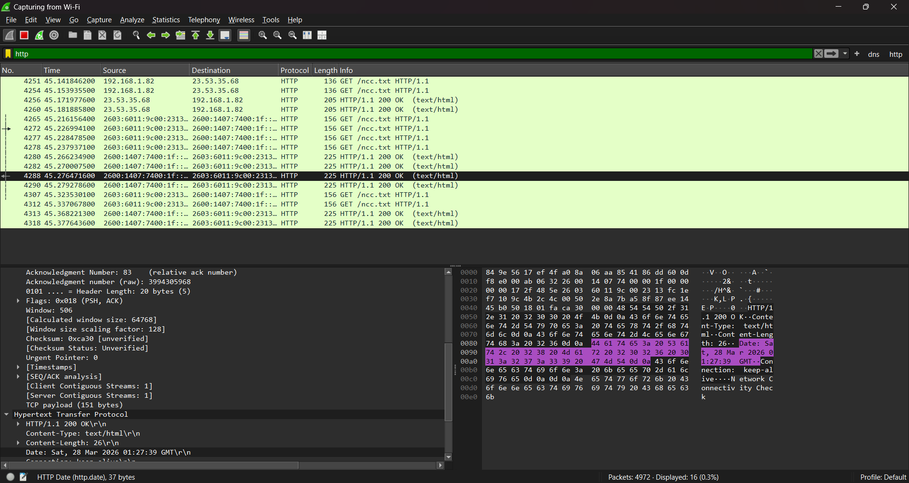
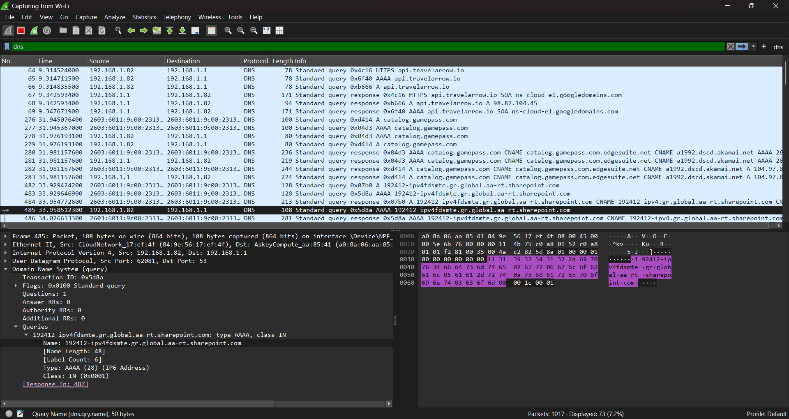
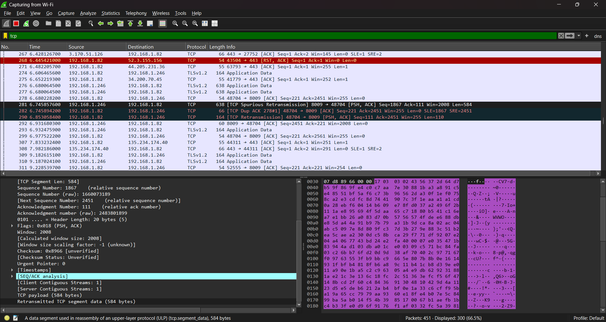

# Wireshark Traffic Analysis Lab

## Objective

Capture and analyze network traffic to identify common protocols, follow communications, and connect packet-level evidence to network troubleshooting and security analysis.

## Environment and Tools

- Wireshark
- Windows computer
- Web browser used to generate test traffic

## Analysis Steps

1. Started a live packet capture on the active network interface.
2. Generated browser and name-resolution traffic.
3. Applied display filters for HTTP, DNS, and TCP.
4. Inspected packet fields and followed TCP streams to view related traffic as a conversation.
5. Compared observed behavior across the application, transport, and network layers.

## Observations

### HTTP

Observed HTTP requests in readable form, demonstrating that unencrypted application data may be visible to systems capable of capturing the traffic.

### DNS

Reviewed domain-name queries and responses used to translate hostnames into IP addresses. DNS metadata can help troubleshoot resolution problems and provide investigative context.

### TCP

Observed TCP connection behavior, including SYN, SYN-ACK, and ACK packets associated with the three-way handshake.

## Practical Relevance

This workflow supports:

- Validating network connectivity
- Troubleshooting DNS and application communication
- Identifying protocols and endpoints
- Establishing normal traffic patterns
- Investigating unusual or suspicious communications

No malicious activity was confirmed in this capture; the project demonstrates the analysis process and interpretation of normal traffic.

## Skills Demonstrated

- Packet capture and display filtering
- TCP/IP and DNS analysis
- TCP stream reconstruction
- Network troubleshooting
- Evidence-based security analysis

[← Back to all projects](../)
